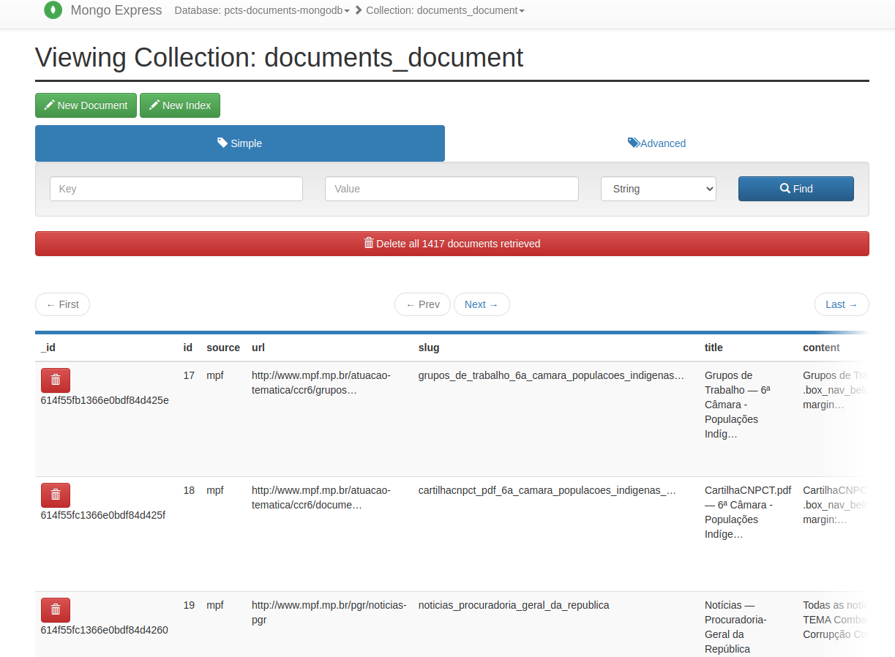

[](https://sonarcloud.io/dashboard?id=fga-eps-mds_2021.1-PCTs-Documents-API)
[](https://sonarcloud.io/dashboard?id=fga-eps-mds_2021.1-PCTs-Documents-API)
[](https://sonarcloud.io/dashboard?id=fga-eps-mds_2021.1-PCTs-Documents-API)

# PCTs Documents API

## Contribuição

1. Clone io repositório
2. Crie uma branch (`git checkout -b feat/x-branch-name`)
3. Commit suas alterações (`git commit -am "Add feat"`)
4. Push para a branch (`git push origin feat/x-branch-name`)

### Extras

- [Guia completo de contribuição completo](https://github.com/fga-eps-mds/2021.1-PCTs-Docs/blob/main/CONTRIBUTING.md)

## Como executar

### Pré requisitos

- [Docker](https://docs.docker.com/engine/install/ubuntu/)
- [Docker Compose](https://docs.docker.com/compose/install/)

### Implatação manual (localmente)

1. Configurar variáveis de ambiente (containers):
  * Atualizar arquivo "env" na raiz do repositório
  * Adicionar os hosts (ips) das apis de documentos e crawlers
  * Variáveis necessárias:
  ```shell
    PCTS_DOCUMENTS_DB_HOST # Host do banco de documentos
    PCTS_DOCUMENTS_DB_PORT # Porta do banco de documentos
    PCTS_DOCUMENTS_DB_USER # Usuario do banco de documentos
    MONGO_INITDB_ROOT_USERNAME # Usuario do banco de documentos (container do db)
    PCTS_DOCUMENTS_DB_PASS # Senha do banco 
    MONGO_INITDB_ROOT_PASSWORD # Senha do banco (Container do db)
    PCTS_DOCUMENTS_DB_NAME # Nome do banco de documentos
    ALLOWED_HOSTS=* # Hosts permitidos a conectar com a api
    ENVIRONMENT=development # Não precisa altera

    ME_CONFIG_MONGODB_SERVER # (Mongo express)
    ME_CONFIG_MONGODB_ADMINUSERNAME # (Mongo express)
    ME_CONFIG_MONGODB_ADMINPASSWORD # (Mongo express)
    ME_CONFIG_MONGODB_ENABLE_ADMIN=true # Não precisa alterar (Mongo express)
    ME_CONFIG_BASICAUTH_USERNAME=admin # Usuario (Mongo express)
    ME_CONFIG_BASICAUTH_PASSWORD=admin # Senha (Mongo express)
  ```

### Iniciar a API

```shell
docker-compose build
docker-compose up
```

### Base de dados

O banco escolhido para esse projeto foi o MongoDB. Ele possui um serviço de visualização gráfica do banco. Em "docker-compose.yml" foi configurado, para quando em execução, está disponível em: localhost:8081.

Atualmente, o caminho para a coleção de documentos/páginas indexadas se encontra em: pcts-documents-mongodb -> documents_document



### Dump da base de dados

Para realizar os procedimentos a seguir, é necessário que o container do banco de dados (pcts-documents-mongodb) esteja em execução.

Obs: O usuário e senha, para realizar as operações abaixo, podem ser encontrados em "docker-compose.yml", nas variáveis de ambiente do container do banco (pcts-documents-mongodb), nomeadamente "MONGO_INITDB_ROOT_USERNAME" e "MONGO_INITDB_ROOT_PASSWORD".
Importante mencionar que, __as credenciais só permanecerão no arquivo "docker-compose.yml" enquanto o projeto estiver em desenvolvimento__.

#### Criar Dump

Para criar um dump da base de dados, execute o seguinte comando:

```shell
docker exec pcts-documents-mongodb sh -c 'mongodump --archive -u {{usuario}} -p {{senha}}' > db_dump/documents_db_dump_$(date '+%d-%m-%Y_%H-%M-%S').gz
```

#### Carregar/Restaurar Dump

Para carregar um dump da base de um arquivo para a base de dados de documentos, execute:

```shell
docker exec -i pcts-documents-mongodb sh -c 'mongorestore --archive -u {{usuario}} -p {{senha}}' < db_dump/{{arquivo_de_dump}}.gz
```

__Exemplo de restauracao para uma base remota (Atlas MongoDB)__:

```shell
mongorestore --uri "mongodb://{{usuario}}:{{senha}}@{{cluster_host}}" --archive < db_dump/{{arquivo_de_dump}}.gz
```
